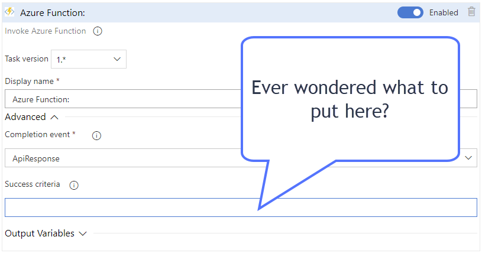
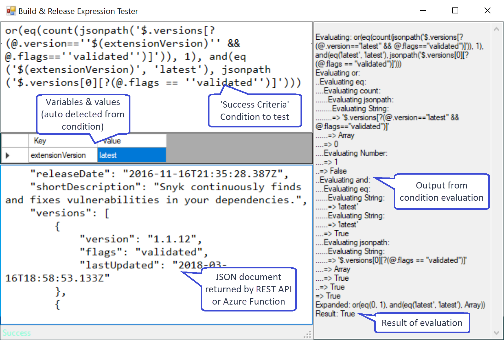

Ever wondered what to put in the Success Criteria field?

Or queued 182 releases to debug the Success Criteria Condition? This little tool will help you locally evaluate your condition syntax in seconds instead of minutes or hours.

# Learn more

[I wrote this little utility while debugging a condition for one of my own extension and blogged about the experience](https://jessehouwing.net/vsts-release-create-complex-release-gate/).

# Prerequisites

To run you must have one of the following prerequisites installed:

 * Team Foundation Server 2018 update 1 or later
 * [Azure DevOps Server 2019 or later](https://visualstudio.microsoft.com/downloads/)
 
It is not required to actually configure the server, so no need for SQL Server, IIS or anything. Just run the installer and cancel the configuration wizard.